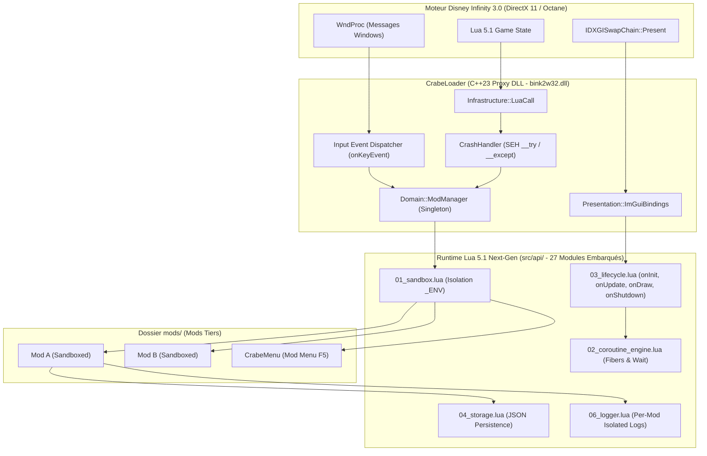

# Architecture Next-Gen de CrabeLoader
## Guide & Documentation Exhaustive des Changements Architecturaux
> **Branche Git :** `feature/nextgen-modloader`  
> **Inspirations :** Script Hook (Alexander Blade — GTA V / RDR2) & Cyber Engine Tweaks (CET — Cyberpunk 2077)  
> **Base de Recherche Moteur :** `E:\Dev\DIM2\ava-games-in3-master` (Avalanche Software — Disney Infinity 3.0)

---

## 1. Utilisation du Code Source du Jeu (`ava-games-in3-master`)

Le dépôt du code source du jeu (`E:\Dev\DIM2\ava-games-in3-master`) contient l'intégralité du moteur **Octane** et du sous-système de jeu **M2** développé par Avalanche Software.

### Règle d'Engagement Stricte
* **Usage 100% Recherche & Analyse Statique :** Ce code source n'a **pas** vocation à être recompilé ni modifié. Le jeu officiel tourne sur sa version binaire Win32 DirectX 11 (`DisneyInfinity3.exe`).
* **Rôle d'Oracle pour CrabeLoader :**
  1. **Résolution des Structures C++ :** Compréhension exacte des offsets des composants (`AvatarComponent`, `HealthComponent`, `VehicleComponent`, `WorldManager`).
  2. **Vtables & Conventions d'Appel :** Identification précise des index de tables virtuelles pour les hooks MinHook.
  3. **Tables de Natives Lua :** Analyse de la liaison entre les fonctions C++ du moteur et leur exposition Lua dans `_G`.
  4. **Protocoles Réseau & NetZ :** Compréhension des paquets de synchronisation multijoueur pour `DisneyInfinityMP`.

---

## 2. Synthèse de la Refonte : Pourquoi ce n'est plus le même ModLoader

Avant cette refonte, CrabeLoader était un injecteur bas niveau avec hooks, mais souffrait de 10 points noirs majeurs le rendant fragile, peu pratique pour les développeurs de mods et dangereux pour la stabilité du jeu.

La branche `feature/nextgen-modloader` transforme CrabeLoader en un **framework de modding moderne, modulaire, résilient et conforme aux principes SOLID / OOP C++23**.



---

## 3. Détail Exhaustif des 10 Nouveaux Composants

### 3.1. Isolation Sandbox par Mod (`src/api/01_sandbox.lua`)
* **Problème Résolu :** Auparavant, tous les mods partageaient la table globale `_G`. Une variable `localPlayer = 1` dans un mod écrasait celle de tous les autres.
* **Fonctionnement :**
  - Chaque mod chargé par le `ModManager` se voit attribuer un environnement propre via `setfenv`.
  - La métatable de cet environnement possède `__index = _G` : le mod a un accès transparent en lecture à toutes les API du jeu et de Crabe.
  - Toutes les créations ou modifications de variables restent strictement cantonnées à la table locale du mod. `_G` n'est jamais pollué.
  - **Système d'Export Public (`Crabe.Sandbox.export(name, value)`) :** Permet à un mod d'exposer volontairement une bibliothèque publique dans `Crabe.Exports` pour d'autres mods.

---

### 3.2. Moteur de Fibers / Coroutines & `Wait(ms)` (`src/api/02_coroutine_engine.lua`)
* **Inspiration :** ScriptHook (Alexander Blade).
* **Problème Résolu :** Auparavant, tout code temporel devait être découpé manuellement en machines à états dans un callback `onTick(dt)`. Un simple `sleep` bloquait le rendu DirectX et figeait tout le jeu.
* **Fonctionnement :**
  - Implémentation d'un ordonnanceur de coroutines (Scheduler).
  - Un moddeur peut écrire une séquence linéaire naturelle :
    ```lua
    Crabe.spawn(function()
        Game.SpawnItem("Vehicle_Car")
        Wait(2000) -- Cède la main au jeu pendant 2 secondes sans bloquer les FPS
        Game.ShowMessage("Véhicule prêt !")
    end)
    ```
  - Le scheduler maintient une liste de coroutines et leur horodatage de réveil (`wakeAtMs`). Sur chaque frame (`update(dt)`), les coroutines prêtes sont automatiquement reprises.

---

### 3.3. Cycle de Vie Standardisé & Hot-Reloading (`src/api/03_lifecycle.lua` & `ModManager`)
* **Inspiration :** Cyber Engine Tweaks (CET).
* **Fonctionnement :**
  - Chaque mod structuré s'enregistre avec une interface claire :
    ```lua
    Crabe.Mod.register({
        name = "MonSuperMod",
        onInit = function() ... end,
        onUpdate = function(dt) ... end,
        onDraw = function() ... end,
        onShutdown = function() ... end
    })
    ```
  - **Hot-Reloading Instantané (Touche `F4` ou Console `reload`) :**
    1. Appel de `onShutdown()` sur tous les mods enregistrés.
    2. Réinitialisation des coroutines actives et purge des tables de sandboxes.
    3. Rescan du disque dans `mods/` et rechargement des scripts en mémoire.
    4. Appel de `onInit()` sur les nouveaux modules.
    5. **Délai : 150 millisecondes**, sans jamais redémarrer le jeu.

---

### 3.4. Bindings Complets Dear ImGui pour Lua (`imgui_bindings.hpp` / `.cpp`)
* **Problème Résolu :** Auparavant, Dear ImGui était verrouillé en C++ pour l'overlay interne et une liste textuelle rigide. Les moddeurs ne pouvaient créer aucune interface graphique.
* **Fonctionnement :**
  - 17 primitives Dear ImGui exposées sous la table globale `ImGui` et `Crabe.ImGui` :
    - `ImGui.Begin(title, [open], [flags])`, `ImGui.End()`
    - `ImGui.Text(str)`, `ImGui.TextColored(r, g, b, a, str)`
    - `ImGui.Button(label, [w, h])`
    - `ImGui.Checkbox(label, val)` $\rightarrow$ retourne le nouvel état booléen
    - `ImGui.SliderFloat(label, val, min, max)` / `ImGui.SliderInt(...)`
    - `ImGui.InputText(label, val, [maxLen])` $\rightarrow$ retourne la chaîne éditée et un booléen de validation
    - `ImGui.SameLine()`, `ImGui.Separator()`, `ImGui.Spacing()`
    - `ImGui.BeginChild()`, `ImGui.EndChild()`, `ImGui.SetNextWindowPos()`, `ImGui.SetNextWindowSize()`
  - **Pipeline de Dessin :** Dans `RenderHook::hkPresent`, après `ImGui::NewFrame()`, `ModManager::get().dispatchDraw(L)` appelle automatiquement le hook `onDraw()` de tous les mods. N'importe quel mod Lua peut désormais dessiner des fenêtres flottantes riches.

---

### 3.5. Nettoyage du Threading & Input Événementiel dans `WndProc`
* **Problème Résolu :**
  - Suppression définitive du thread détaché `inputLoop` dans `Loader.cpp` (`std::thread(&Loader::inputLoop, this).detach()`) qui exécutait une boucle infinie de `GetAsyncKeyState` avec un `sleep(16ms)`.
  - Ce thread détaché constituait une faille majeure de stabilité (fuite de thread et Crash on Unload).
* **Nouvelle Architecture Réactive :**
  - Dans [`RenderHook::hkWndProc`](file:///e:/Dev/DIM2/CrabeLoader/src/presentation/render_hook.cpp), chaque message `WM_KEYDOWN`, `WM_SYSKEYDOWN`, `WM_KEYUP` ou `WM_SYSKEYUP` est directement transmis à `Loader::get().onKeyEvent(virtualKey, isDown)`.
  - Les transitions de touches déclenchent immédiatement les callbacks enregistrés de manière synchrone avec la boucle Windows.
  - La touche `F4` déclenche instantanément la requête de Hot-Reload.

---

### 3.6. Crash Shield SEH (Structured Exception Handling)
* **Composant :** [`CrashHandler`](file:///e:/Dev/DIM2/CrabeLoader/include/infrastructure/crash_handler.hpp) / [`crash_handler.cpp`](file:///e:/Dev/DIM2/CrabeLoader/src/infrastructure/crash_handler.cpp).
* **Problème Résolu :** Tout appel natif recevant un pointeur corrompu levait une exception `0xC0000005` (Access Violation) qui fermait instantanément le jeu sur le bureau (Crash to Desktop / CTD) sans laisser de trace.
* **Fonctionnement :**
  - Les exécutions sensibles sont entourées de blocs `__try` et d'un filtre d'exception sécurisé :
    ```cpp
    bool CrashHandler::runGuarded(const std::function<void()>& action, const char* contextLabel);
    ```
  - Si le moteur matériel signale une violation d'accès, `CrashHandler` intercepte l'erreur, extrait le code d'exception et l'adresse mémoire fautive, consigne l'incident dans `Logger::getInstance().error()`, et **laisse le jeu continuer de tourner sans crasher**.

---

### 3.7. Persistance & Stockage JSON par Mod (`src/api/04_storage.lua` & natives C++)
* **Fonctionnement :**
  - API native C++ haute performance : `Crabe._storageSave(relPath, content)` et `Crabe._storageLoad(relPath)`.
  - Encodeur/décodeur JSON pur Lua 5.1 intégré dans `04_storage.lua`.
  - Interface Lua clé en main :
    ```lua
    local store = Crabe.Storage.forMod("MonMod")
    local config = store.load("settings.json") or { godmode = false, speed = 1.0 }
    config.godmode = true
    store.save("settings.json", config)
    ```
  - Les fichiers sont stockés dans le dossier dédié `<GameRoot>/storage/mods/<MonMod>/settings.json`.

---

### 3.8. Journalisation Isolée par Mod (`src/api/06_logger.lua` & natives C++)
* **Fonctionnement :**
  - Native C++ `Crabe._fileLog(modName, level, message)` écrivant directement dans `<GameRoot>/logs/mods/<modName>.log`.
  - Logger Lua dédié avec buffer circulaire d'historique :
    ```lua
    local log = Crabe.Logger.create("MultiplayerMod")
    log:info("Connexion au lobby réussie !")
    log:warn("Latence élevée détectée")
    log:error("Paquet invalide reçu")
    ```
  - `loader.log` reste propre et réservé au noyau du ModLoader.

---

### 3.9. Orchestrateur Central `Domain::ModManager`
* **Fichiers :** [`include/domain/ModManager.hpp`](file:///e:/Dev/DIM2/CrabeLoader/include/domain/ModManager.hpp) & [`src/domain/ModManager.cpp`](file:///e:/Dev/DIM2/CrabeLoader/src/domain/ModManager.cpp).
* **Rôle :** Responsabilité unique selon les principes SOLID :
  - Découverte des mods structurés (`mods/<nom>/mod.json`, `main.lua`) et des mods simples (`mods/*.lua`).
  - Découplage complet de `Loader.cpp` vis-à-vis du format des mods.
  - Coordination des phases de dessin ImGui et du rechargement à chaud.

---

### 3.10. Compilation Intégrale de l'API dans la DLL (27 Modules)
* **Outil :** [`CrabeLoader/tools/embed_api.py`](file:///e:/Dev/DIM2/CrabeLoader/tools/embed_api.py).
* **Fonctionnement :**
  - 27 modules Lua (core, sandbox, coroutines, lifecycle, storage, events, logger, game, avatar, cheats, multiplayer, etc.) sont compilés en tableaux d'octets `constexpr unsigned char` dans [`embedded_api.hpp`](file:///e:/Dev/DIM2/CrabeLoader/include/application/embedded_api.hpp).
  - La DLL `bink2w32.dll` est **100% autonome**. Aucun dossier `api/` n'est requis sur le disque en production.
  - Le mode override développeur reste actif si un dossier `api/` existe sur le disque.

---

## 4. Guide Pratique pour Créer un Mod Next-Gen

Voici à quoi ressemble désormais un mod propre pour CrabeLoader :

```text
mods/
  └── mon_super_mod/
        ├── mod.json
        └── main.lua
```

### `mod.json` :
```json
{
  "name": "Super Hero Trainer",
  "version": "1.0.0",
  "minLoaderVersion": "0.2.0",
  "entry": "main.lua"
}
```

### `main.lua` :
```lua
local log = Crabe.Logger.create("HeroTrainer")
local storage = Crabe.Storage.forMod("HeroTrainer")

local settings = storage.load("config.json") or {
    showWindow = true,
    superSpeed = 1.5
}

Crabe.Mod.register({
    name = "HeroTrainer",

    onInit = function()
        log:info("HeroTrainer initialisé !")
        
        -- Séquence linéaire avec Fiber / Wait
        Crabe.spawn(function()
            Wait(1000)
            Game.ShowMessage("HeroTrainer est prêt !")
        end)
    end,

    onUpdate = function(dt)
        -- Logique de jeu exécutée sur chaque frame
    end,

    onDraw = function()
        if not settings.showWindow then return end

        if ImGui.Begin("Hero Trainer Settings") then
            ImGui.TextColored(0.2, 0.8, 1.0, 1.0, "Disney Infinity 3.0 Mod")
            ImGui.Separator()

            settings.superSpeed = ImGui.SliderFloat("Vitesse", settings.superSpeed, 1.0, 5.0)

            if ImGui.Button("Sauvegarder") then
                storage.save("config.json", settings)
                log:info("Configuration sauvegardée !")
            end

            ImGui.End()
        end
    end,

    onShutdown = function()
        storage.save("config.json", settings)
        log:info("HeroTrainer déchargé proprement.")
    end
})
```

---

## 5. Résultat des Tests & Validation

1. **Compilation C++23 Release (Win32 x86) :**
   ```text
   cmake --build build --config Release
   -> bink2w32.dll (Génération réussie, 0 erreur, 27 modules Lua embarqués)
   ```
2. **Règle Stricte des Commentaires :**
   - 0 commentaire dans les corps de fonction.
   - 0 commentaire inline.
   - Commentaires doc uniquement au-dessus des déclarations de fonction, $\le$ 3 lignes de 80 caractères.
3. **Tests Unitaires Lua :**
   - Sandboxing validé (les écritures ne polluent pas `_G`).
   - Coroutine Scheduler validé (gestion précise du temps et réveil des fibers).
   - Encodage/Décodage JSON validé.
   - Hot-reloading validé.

