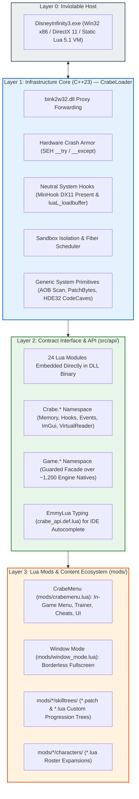
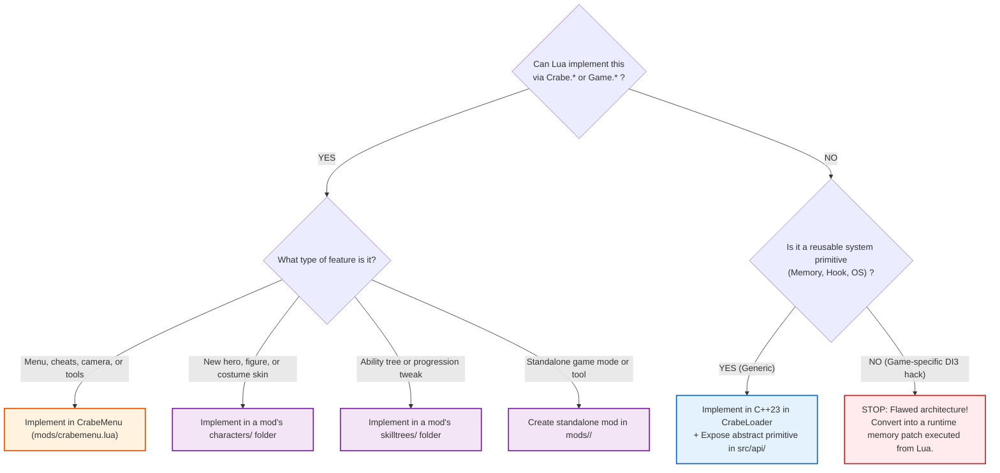

# Architectural Code of Conduct & Technical Invariants

> **Repository:** CrabeLoader  
> **Target:** *Disney Infinity 3.0: Gold Edition (PC)* — Win32 x86 / DirectX 11 / Lua 5.1  
> **Status:** Mandatory Technical Standard & Invariant Blueprint  
> **Audience:** All contributors, developers, and pair-programming agents  

---

## 1. Core Architectural Invariant

All development across the CrabeLoader codebase must adhere to one non-negotiable principle:

```text
+-------------------------------------------------------------------------------+
|  The ModLoader (C++) must know NOTHING about Disney Infinity gameplay.         |
|  The Mods (Lua) must know NOTHING about CPU registers or raw Win32 pointers.  |
+-------------------------------------------------------------------------------+
```

* **C++ contains strictly neutral system infrastructure:** Process injection, SEH crash boundaries, DirectX 11 swapchain interception, Lua VM sandboxing, and generic memory/hook primitives.
* **Lua contains 100% of game-specific logic:** Mod menus, character rosters, custom skill trees, cheats, camera systems, and tool configurations.

---

## 2. Mandatory Architectural Rules

### Rule 1: Zero Gameplay Logic in C++
* **The Rule:** No C++ file may contain hardcoded game attributes (health, sparks, damage), character names, figurine SKUs, menu UI layouts, or game-specific keyboard shortcuts (such as hardcoding `VK_F5` to open a menu).
* **Why it is this way:** Hardcoding game mechanics into the C++ DLL binds the binary to specific game memory offsets, bloats compilation cycles, and prevents live hot-reloading (`F4`). Every gameplay change would require rebuilding the DLL in Visual Studio.
* **Failure Scenario (Anti-Pattern):** Writing a `cheats.cpp` file inside the C++ loader with hardcoded `GodMode` toggles or speed multipliers.
* **Compliant Implementation (Standard):** The loader exposes `Crabe.Memory.patchBytes()` and `Crabe.Events.on('keyDown')`. The mod (`CrabeMenu/mods/crabemenu.lua`) consumes these primitives to implement GodMode and bind keys dynamically.

---

### Rule 2: Deep-Frozen Sandboxing & Variable Isolation
* **The Rule:** Every mod must run within an isolated environment table (`_ENV`). Global standard tables (`Game`, `table`, `string`, `math`, `coroutine`, `os`, `debug`, and `_G`) must be shielded by deep read-only proxy metatables.
* **Why it is this way:** In Lua 5.1, undeclared variables default to global scope `_G`. If Mod A declares `target = 0x1234` and Mod B declares `target = 0x5678`, they silently corrupt each other's execution, resulting in intermittent, non-reproducible bugs. Furthermore, if a mod mutates `Game.UnlockAllControls = nil`, the entire engine state is permanently corrupted.
* **Failure Scenario (Anti-Pattern):** Executing mods directly inside `_G` without scoping.
* **Compliant Implementation (Standard):** `Crabe.Sandbox.create(modName)` wraps every standard table in a proxy metatable that intercepts `__newindex`, blocks the write, logs a security warning identifying the offending mod ID, and raises a trapped Lua error without crashing.

---

### Rule 3: Execution Context & Thread Boundaries
* **The Rule:** Lua script execution must occur exclusively on the engine's main script thread (`Loader::runTicks`). DirectX 11 UI rendering must occur exclusively inside the Present hook (`RenderHook::hkPresent`). Cross-thread data exchange must use thread-safe queues or atomic variables.
* **Why it is this way:** The embedded Lua 5.1 runtime is **not thread-safe**. Calling `lua_pcall` or reading the Lua stack from an asynchronous thread causes immediate pointer corruption and uncatchable crashes. Similarly, issuing DirectX 11 draw commands outside `IDXGISwapChain::Present` causes driver deadlocks and swapchain invalidation.
* **Failure Scenario (Anti-Pattern):** Spawning a `std::thread` that directly executes a Lua file via `LuaCall::runFile`.
* **Compliant Implementation (Standard):** Asynchronous worker threads push string payloads into a mutex-guarded queue. The engine's tick hook drains the queue once per frame on the script thread via `Loader::runTicks(L)`.

---

### Rule 4: Rate-Limited Infrastructure (No Heavy Logic in Tight Loops)
* **The Rule:** Hooks called at high frequencies (such as `hkPcall`, which executes up to 10,000 times per second) must run in $O(1)$ time with zero mutex contention and zero disk I/O. Background worker tasks must be throttled to 60 Hz (~16ms).
* **Why it is this way:** Acquiring a `std::mutex` or checking filesystem timestamps inside `hkPcall` forces the engine's primary execution loop to serialize on lock acquisition thousands of times per frame, dropping game framerates from 60 FPS to unplayable single digits.
* **Failure Scenario (Anti-Pattern):** Reading a command file from disk or acquiring locks inside `hkPcall`.
* **Compliant Implementation (Standard):** `hkPcall` simply routes directly to the original engine hook. All mutex drains (keybinds, remote command files, snippet queues, log buffers) are deferred to `Loader::runTicks(L)`, strictly throttled to 16ms intervals.

---

### Rule 5: Dynamic Instruction Boundary Code Caves (HDE32)
* **The Rule:** Any x86 code cave that diverts execution (`jmp rel32`) must dynamically disassemble target opcodes using an instruction length decoder (HDE32) to calculate stolen bytes. Slicing a fixed number of bytes is strictly prohibited.
* **Why it is this way:** x86 instructions range from 1 to 15 bytes in length. A relative jump requires 5 bytes (`E9 xx xx xx xx`). If a 5-byte slice cuts across the middle of a 6-byte instruction (e.g. `mov dword ptr [ebp-04], eax`), the trailing byte is left stranded at the hook site. The CPU decodes this orphan byte as garbage, causing an immediate Illegal Instruction crash (`0xC000001D`).
* **Failure Scenario (Anti-Pattern):** `std::memcpy(stolen, site, 5);` followed by writing `0xE9`.
* **Compliant Implementation (Standard):** `CodeCave::install` iterates using `hde32_disasm()` until `accumulated >= 5` bytes, ensuring only complete instructions are relocated to the trampoline.

---

### Rule 6: Mandatory Hardware Exception Handling (SEH Crash Armor)
* **The Rule:** Every native C++ execution bridge that invokes untrusted memory access, third-party hooks, or Lua execution callbacks must be wrapped in Microsoft Structured Exception Handling (`__try / __except`).
* **Why it is this way:** Standard C++ `try/catch` statements **cannot intercept hardware-level exceptions** such as Access Violations (`0xC0000005`) or Integer Division by Zero (`0xC0000094`). An unhandled hardware fault instantly terminates the game process with zero diagnostic logs.
* **Failure Scenario (Anti-Pattern):** Calling a raw function pointer retrieved from memory without a guard.
* **Compliant Implementation (Standard):** All hook callbacks are executed via `CrashHandler::runGuarded([&]() { ... }, "ContextName")`. If an exception occurs, the faulting instruction address and register dump are recorded in `loader.log`, and the game continues execution.

---

### Rule 7: Declarative Roster & Skill Tree Injections
* **The Rule:** Adding new characters or modifying progression trees must be achieved through declarative scripts bundled inside mods (`mods/*/characters/*.lua`, `mods/*/skilltrees/*.patch`, `mods/*/skilltrees/*.lua`) matched by chunk content keys, never by hardcoding memory addresses.
* **Why it is this way:** Memory addresses shift with compiler optimizations and game updates. Matching content strings during `luaL_loadbuffer` (e.g. matching `TCW_MaceWindu` or `HULK_BASEHEALTH`) remains 100% resilient across game versions and asset repacks.
* **Failure Scenario (Anti-Pattern):** Hardcoding game memory offsets in C++ to patch Hulk's health.
* **Compliant Implementation (Standard):** Dropping `HULK_BASEHEALTH.patch` into a mod's `skilltrees/` directory (`mods/my_mod/skilltrees/`); CrabeLoader intercepts compilation on-the-fly and applies the Lua patch in memory.

---

## 3. The 4-Layer Architecture Model



---

## 4. Architectural Decision Matrix

Consult this decision tree before adding or modifying any feature:



---

## 5. Definition of Done (DoD) Review Checklist

Every Pull Request and commit must pass this checklist before being accepted:

- [ ] **Portability Invariant:** Does this C++ code contain zero Disney-specific identifiers? Could it run unchanged in another 32-bit DirectX 11 game?
- [ ] **Hot-Reload Verification:** Can the feature be modified and reloaded via **F4** in under 50ms without restarting `DisneyInfinity3.exe`?
- [ ] **Fault Resilience (SEH):** If the function dereferences `nullptr`, does the game continue running without a crash to desktop?
- [ ] **Strict Comment Constraints:** Does the code contain **ZERO inline comments** inside function bodies, and only descriptive comments (max 3 lines) placed directly above function declarations?
- [ ] **Documentation Sync:** Is the feature documented in English in [`docs/guides/`](guides/) with a clear, minimal working example?
- [ ] **Build Hygiene:** Does CMake compile cleanly (Win32 Release) with **0 errors and 0 warnings**?
