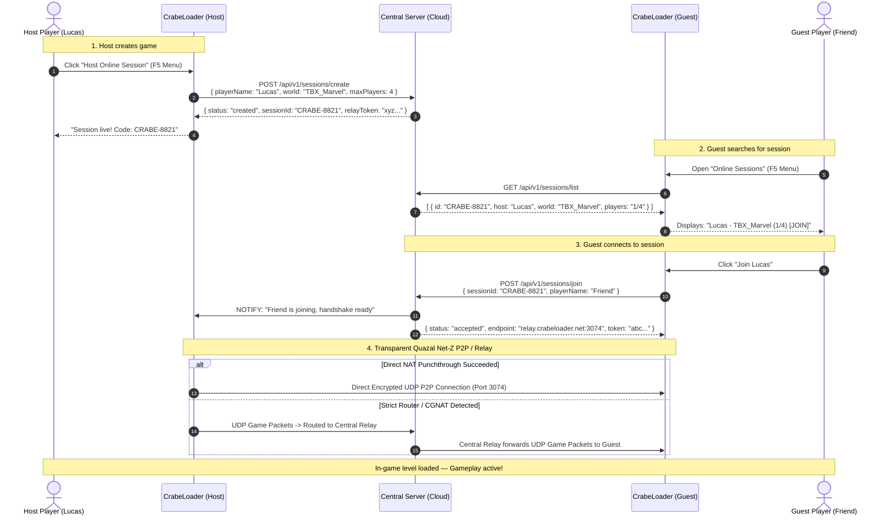

# Disney Infinity 3.0 — Central Server Multiplayer Architecture

## 1. Executive Summary & Current Situation

### The Context

* **Original Architecture (2015):** Disney Infinity 3.0 relied on a hybrid network model:
  1. **A central backend (Disney / Avalanche Software / Quazal):** Handled authentication, friend lists, matchmaking, session discovery, and UGC (Toybox sharing).
  2. **Peer-to-Peer gameplay (Quazal Net-Z):** In-game physics and entity synchronization ran directly between players over UDP (port 3074).
* **The Gold Edition (2016):** When Disney shut down the official infrastructure in 2016–2017, they released the *Gold Edition* on Steam (AppID `543570`):
  - Official backend servers were permanently taken offline.
  - Multiplayer menus were hidden and blocked via Lua script guards.
  - Valve disabled Steam Matchmaking Lobbies on AppID `543570` at the Steam backend level (calling `CreateLobby` returns `AccessDenied`).
  - However, the underlying **Quazal Net-Z C++ replication engine was never removed** from `DisneyInfinity3.exe`.

### The Problem With Raw P2P (Direct IP)

While raw Direct IP (connecting by typing `86.223.186.100:3074`) works with our current patches, it has major usability downsides:

1. **Privacy & Security:** Players must expose and exchange their personal public IP addresses.
2. **NAT & Router Restrictions:** Players on strict firewalls, universities, 4G/5G routers, or CGNAT (Carrier-Grade NAT) cannot accept incoming UDP connections without manual port forwarding.

### The Solution: A Central Dedicated Master & Relay Server

By deploying a lightweight Central Server:

- **Zero IP sharing:** Players never see, type, or exchange an IP address.
- **Zero router configuration:** Built-in NAT traversal (STUN / UDP Relay) bypasses strict NAT and CGNAT automatically.
- **Seamless UX:** Players see an in-game lobby browser: click **Host**, your friend sees your session in their menu, clicks **Join**, and the game loads.

---

## 2. System Architecture

```
┌─────────────────────────────────────────────────────────────────────────┐
│                              CENTRAL SERVER                             │
│                                                                         │
│  ┌───────────────────────────────┐     ┌─────────────────────────────┐  │
│  │   Matchmaker & Session API    │     │      UDP Packet Relay       │  │
│  │   - Session discovery / list  │     │   - STUN NAT-traversal      │  │
│  │   - Token authentication      │     │   - TURN UDP fallback       │  │
│  │   - Real-time room registry   │     │   - Quazal Net-Z forwarder  │  │
│  └───────────────▲───────────────┘     └──────────────▲──────────────┘  │
└──────────────────┼────────────────────────────────────┼─────────────────┘
                   │ HTTPS / WebSocket                  │ UDP (3074 / Encapsulated)
                   │                                    │
         ┌─────────┴─────────┐                ┌─────────┴─────────┐
         │                   │                │                   │
┌────────┴────────┐ ┌────────┴────────┐ ┌─────┴───────────┐ ┌─────┴───────────┐
│ Host Client     │ │ Guest Client    │ │ Host Net-Z      │ │ Guest Net-Z     │
│ (CrabeLoader)   │ │ (CrabeLoader)   │ │ Game Engine     │ │ Game Engine     │
└─────────────────┘ └─────────────────┘ └─────────────────┘ └─────────────────┘
```

---

## 3. Communication Sequence Diagram

The following sequence diagram illustrates how two players meet and play without ever exposing an IP address:



---

## 4. Why This Completely Eliminates Previous Limitations

| Feature                             | Raw P2P (Direct IP)                    | Central Server Architecture                                      |
| :---------------------------------- | :------------------------------------- | :--------------------------------------------------------------- |
| **IP Privacy**                | ❌ IP address shared manually in chat  | ✅**100% Hidden** (routed through server or private token) |
| **Router Port Forwarding**    | ⚠️ Required if router blocks UPnP    | ✅**None required** (STUN / TURN handles traversal)        |
| **CGNAT / 4G / Campus Wi-Fi** | ❌ Impossible to host                  | ✅**Fully supported** via UDP relay fallback               |
| **User Experience**           | ❌ Copy-pasting numbers and ports      | ✅**1-Click Join** from in-game list or short Room Code    |
| **Steam Dependency**          | ⚠️ Blocked by Valve for AppID 543570 | ✅**Independent** (works on Steam, Epic, or standalone)    |

---

## 5. Current State of CrabeLoader Readiness

CrabeLoader already has the core low-level components implemented and tested in memory:

1. **WinHttp Redirection Hook (`render_hook.cpp` / `MultiplayerManager.cpp`):**
   - Game HTTP traffic is intercepted at the Win32 API level.
   - Redirects requests to any custom server IP/Domain dynamically.
2. **Engine Memory Patches:**
   - 6 engine memory patches are confirmed active in `DisneyInfinity3.exe`.
   - `IsMultiplayerAllowed`, `IsOnline`, and social authorization gates return `true`.
3. **CrabeMenu & Lua Runtime:**
   - In-game overlay (`F5`) dynamically populates submenu entries.
   - Remote command execution allows hot updates and real-time session feedback.

---

## 6. Implementation Roadmap

### Step 1: Central Server Prototype (Node.js or Python)

- Create a lightweight backend exposing:
  - `POST /api/sessions/announce`: Register a host session.
  - `GET /api/sessions`: List all active public sessions.
  - `POST /api/sessions/join`: Initiate handshake between host and guest.
  - `POST /api/sessions/heartbeat`: Keep alive / automatic cleanup after disconnect.

### Step 2: In-Game UI Integration

- In `DisneyInfinityMP/modules/ui.lua`:
  - Hook the `Browse Available Net-Z Sessions` menu entry to query `GET /api/sessions`.
  - Display available games as clickable buttons.
  - Clicking a game immediately triggers `Session.connect(sessionToken)`.

### Step 3: UDP Relay (TURN Fallback)

- For users behind strict symmetric NAT:
  - Add a lightweight UDP relay forwarder on the server.
  - If direct hole-punching fails after 1.5 seconds, automatically reroute Net-Z UDP packets through the central server relay.
