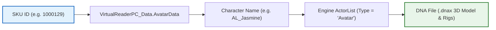

# CrabeLoader V2 — Character & Figurine Modding Guide

Welcome to the **CrabeLoader V2** Character & Figurine Modding Guide.

In *Disney Infinity 3.0 (PC)*, playable characters are normally tied to physical RFID figurine bases. On PC, the game emulates this hardware via a virtual reader table (`Presentation/VirtualReaderPC_Data.lua`). CrabeLoader V2 provides a clean, decoupled Lua API (`Crabe.VirtualReader` and `Crabe.Hooks`) that lets you inject unreleased heroes, custom skins, and new roster entries directly into the game.

---

## 1. How Character Resolution Works

Understanding the engine's resolution chain is essential to avoid common pitfalls (like a tile appearing in the grid, but loading a blank or falling character):



* **The Rule of Identity:** The `Name` attribute is the true key, not the numeric `sku_id`. An invented `sku_id` works fine, but an unknown `Name` will fail.
* `Name:lower()` **must exist** in the game's internal `ActorList` with `Type = "Avatar"`. If the engine cannot find the actor definition, the 3D model cannot be instantiated.

---

## 2. Two Types of Custom Characters

| Operation | Purpose | Complexity |
| :--- | :--- | :--- |
| **`addCharacter` (Cosmetic Variant)** | Creates a new identity or costume variant over an existing character's model and abilities, borrowing its `sku_id`. | Low (Guaranteed to work) |
| **`exposeCharacter` (Stand-Alone Hero)** | Surfaces an unreleased character whose 3D mesh, animations, voice lines, and skill tree are already inside the game files, but which lacks an official catalog row. | Medium (Requires dedicated SKU) |

---

## 3. Directory Layout

Character declaration scripts can be placed in two locations:

```text
Disney Infinity 3.0 Gold Edition/
├── characters/
│   ├── CRABE_MaceWindu.lua   <- Global character declaration
│   └── CRABE_Thanos.lua      <- Global character declaration
└── mods/
    └── my_hero_pack/
        ├── mod.json
        └── characters/
            └── CustomHero.lua <- Modular character declaration
```

CrabeLoader automatically scans both directories on game boot.

---

## 4. Declaring a Custom Character

### Example 1: Exposing Mace Windu (`CRABE_MaceWindu.lua`)

Mace Windu has full combat animations, combo trees, and lightsaber visual effects shipped in Disney Infinity 3.0 assets, but was never released as a standalone retail PC SKU. We can expose him with `exposeCharacter`:

```lua
-- characters/CRABE_MaceWindu.lua

Crabe.VirtualReader.exposeCharacter({
    Name = "TCW_MaceWindu",
    DisplayName = "Mace Windu",
    Franchise = "StarWars",
    Icon = "HUD_PlayerIcons_MaceWindu",
    Description = "Jedi High Council Master and creator of Vaapad lightsaber combat.",
    ProgressionTree = "tcw_macewindu",
    MetaData = "StarWars,Franchise_SW,Jedi,Lightsaber",
})
```

### Example 2: Exposing Thanos (`CRABE_Thanos.lua`)

```lua
-- characters/CRABE_Thanos.lua

Crabe.VirtualReader.exposeCharacter({
    Name = "MV_Thanos",
    DisplayName = "Thanos",
    Franchise = "Marvel",
    Icon = "HUD_PlayerIcons_Thanos",
    Description = "The Mad Titan wielding cosmic strength and devastating heavy strikes.",
    ProgressionTree = "mv_thanos",
    MetaData = "Marvel,Franchise_MV,Villain,Boss",
})
```

---

## 5. Automatic SKU Allocation & Ranges

Official Disney Infinity retail figurines occupy SKU IDs between `1000001` and `1000339`:
* Disney Infinity 1.0: `1000001` – `1000038`
* Disney Infinity 2.0 (Marvel / Disney Originals): `1000100` – `1000140`
* Disney Infinity 3.0 (Star Wars / Marvel Battlegrounds): `1000200` – `1000339`

CrabeLoader reserves the **`1000340+` range** for custom mods. When you declare a character without providing an explicit SKU, `Crabe.VirtualReader` deterministically derives a stable numeric SKU from the character's name, preventing collisions across different mods.

---

## 6. Unlocking the Figurine Selection Grid

By default, Disney Infinity 3.0 marks figurines as "locked" unless physical RFID data was scanned.

CrabeLoader automatically bypasses this restriction with the runtime grid unlocker:
* The unlocker patches `virtualreaderpc_gridcharacter.lua` dynamically in memory.
* All 104 default characters, plus all custom exposed characters, become selectable with full loadouts and progression trees unlocked.

---

## 7. Real-Time Model Swapping in `CrabeMenu`

Once characters are registered, you can switch between any of the 104 heroes on the fly during gameplay without returning to the main menu:

1. Press **`F5`** in-game to open [CrabeMenu](file:///e:/Dev/DIM2/CrabeMenu/mods/crabemenu.lua).
2. Navigate to the **"Heroes"** tab.
3. Select your franchise (**Star Wars**, **Marvel**, or **Disney/Pixar**).
4. Choose any hero to instantly hot-swap the avatar model in live gameplay!
