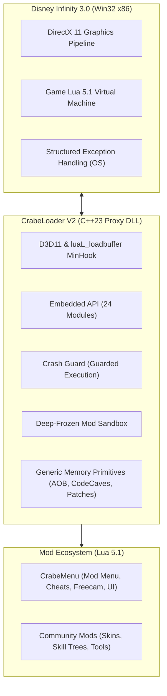

# CrabeLoader V2 — Documentation & Modding Guides

Welcome to the official **CrabeLoader V2** documentation suite. 

This directory contains in-depth, structured guides in plain English covering every aspect of extending and modding **Disney Infinity 3.0: Gold Edition (PC)**.

---

## 📚 Guides in this Section

| Guide | Description | Target Audience |
| :--- | :--- | :--- |
| **[Mod Development Guide](mods.md)** | Learn how to build standalone and folder-based Lua mods, hook lifecycle events (`onInit`, `onUpdate`, `onDraw`, `onShutdown`), design Dear ImGui interfaces, apply memory patches, and leverage live hot-reloading (`F4`). | Beginner to Advanced Modders |
| **[Skill Tree Modding Guide](skilltrees.md)** | Comprehensive breakdown of how character abilities and progression trees are loaded. Learn how to write chunk patches (`.patch`) and full source overrides (`.lua`) to customize combat stats, reduce costs, or build brand-new skill branches. | Intermediate Modders |
| **[Character & Figurine Guide](characters.md)** | Master the game's figurine resolution pipeline (`SKU -> AvatarData -> Name -> ActorList -> DNA`). Learn how to expose unreleased figures (Mace Windu, Thanos) and register custom character variants using `Crabe.VirtualReader`. | All Modders & Roster Creators |
| **[crabe-cli Reference](cli.md)** | Scaffold a new mod, validate a manifest, run the real dependency resolver, and catch Lua API typos -- all offline, without launching the game. | All Modders & CI Pipelines |

---

## 🏛️ Architectural Foundations (CrabeLoader V2)

CrabeLoader V2 is built around a decoupled **SOLID architecture**:

### Core Tenets of V2
1. **Zero Gameplay in C++:** `CrabeLoader` contains no hardcoded cheats, speedhacks, or menus. It is purely an engine platform.
2. **Crash-Resilient:** All mod hooks and UI rendering run inside SEH-guarded wrappers. A bug in a mod will log an error without crashing the game to desktop.
3. **Deep Sandbox:** Each mod runs in an isolated environment. Core tables (`Game`, `table`, `string`, `math`, `_G`) are protected by read-only proxy metatables.
4. **Single-File Setup:** All standard API modules are compiled directly into `bink2w32.dll`. No loose `api/` scripts are required.
5. **Instant Iteration:** Press **F4** in-game to hot-reload all mods in under 50 milliseconds without restarting the game.

---

## 🔗 Additional References

* **[Native Function Database](../nativedb.md):** Alphabetical encyclopedia of discovered C++ engine functions exposed to Lua.
* **[Lua API Type Definitions (`crabe_api.def.lua`)](../crabe_api.def.lua):** EmmyLua type annotations for VS Code autocomplete and diagnostics.
* **[Quickstart Guide](../modding.md):** Fast introduction to running your first Hello World mod.
