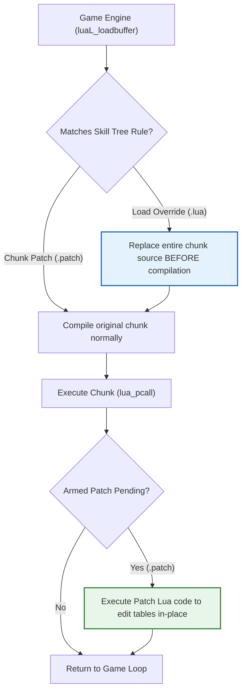

# CrabeLoader V2 — Skill Tree Modding Guide

Welcome to the **CrabeLoader V2** Skill Tree Modding Guide.

In *Disney Infinity 3.0 (PC)*, character abilities, combat combos, durability upgrades, and special attacks are defined in encrypted Lua scripts loaded on demand by the engine. CrabeLoader intercepts these chunks at the bytecode compilation boundary, allowing you to modify existing skills or build completely custom upgrade trees without modifying original game archives.

---

## 1. How Skill Trees Work in the Engine

When a character is placed on the base or swapped into the world, the game calls `luaL_loadbuffer` to compile that character's specific progression tree. 

CrabeLoader hooks `luaL_loadbuffer` and offers two distinct ways to modify skill trees:



1. **Load Overrides (`.lua` files):** Replaces the chunk's entire source code *before* compilation. Best for overhauling an entire skill tree from scratch.
2. **Chunk Patches (`.patch` files):** Runs custom Lua code immediately *after* the original chunk finishes executing. Best for tweaking values (damage, health, upgrade costs) without having to rewrite or maintain the whole tree.

---

## 2. Directory Placement

In CrabeLoader V2, all custom skill tree files live strictly inside a mod folder under `mods/`:

```text
Disney Infinity 3.0 Gold Edition/
└── mods/
    └── my_combat_rebalance/
        ├── mod.json
        ├── main.lua
        └── skilltrees/
            ├── HULK_BASEHEALTH.patch <- Mod-bundled patch for Hulk
            └── tcw_macewindu.lua     <- Mod-bundled override for Mace Windu
```

CrabeLoader automatically scans `<GameRoot>/mods/*/skilltrees/` on startup. You can also register patches dynamically from any Lua mod using `Crabe.Hooks.patchChunk()` or `Crabe.Hooks.overrideChunk()`.

---

## 3. How Chunk Matching Works

You do **not** need to search for memory addresses or encrypted archive paths. CrabeLoader matches chunks using a **content matching key**:
* The file's stem (the filename without `.lua` or `.patch`) is used as a case-sensitive substring match against the chunk's source code.
* For example, naming your patch `HULK_BASEHEALTH.patch` tells CrabeLoader: *"Find the chunk that contains the string `HULK_BASEHEALTH`, let it build its tables, then immediately execute this patch script."*

---

## 4. Writing a Chunk Patch (`.patch`)

A `.patch` file contains standard Lua 5.1 code that modifies the tables constructed by the target chunk.

### Example: Doubling Hulk's Health & Reducing Costs
Create `skilltrees/HULK_BASEHEALTH.patch`:

```lua
-- HULK_BASEHEALTH.patch
-- Modifies Hulk's initial health and makes upgrades cost 1 coin

if type(SkillTree) == "table" and SkillTree.Nodes then
    for id, node in pairs(SkillTree.Nodes) do
        -- Check node type
        if node.StatType == "Health" or node.StatType == "Durability" then
            node.BonusMultiplier = (node.BonusMultiplier or 1.0) * 2.0
            node.Cost = 1 -- Reduce cost to 1 spark
        end
    end
end

-- Modify base stats table
if type(CharacterStats) == "table" and CharacterStats.Hulk then
    CharacterStats.Hulk.BaseHealth = 2000.0
end
```

Because this runs immediately after the chunk executes, the modified stats and nodes are already loaded before the player opens the Skill Tree UI in-game.

---

## 5. Writing a Load Override (`.lua`)

A `.lua` file replaces the entire source code of the chunk before it is passed to the compiler.

### Example: Custom Tree for Mace Windu (`skilltrees/tcw_macewindu.lua`)

```lua
-- tcw_macewindu.lua
-- Complete replacement for Mace Windu's progression tree

local Tree = {}
Tree.CharacterName = "TCW_MaceWindu"
Tree.MaxPoints = 30

Tree.Nodes = {
    [1] = {
        Id = 1,
        Name = "Vaapad Mastery",
        Description = "Increases lightsaber attack speed and critical strike chance.",
        Icon = "GUI_SkillTree_LightsaberSpeed",
        Cost = 2,
        Requires = {},
        StatType = "AttackSpeed",
        Value = 1.35
    },
    [2] = {
        Id = 2,
        Name = "Shatterpoint Sense",
        Description = "Reveals weak points in enemy armor, dealing 50% extra damage.",
        Icon = "GUI_SkillTree_CriticalStrike",
        Cost = 3,
        Requires = { 1 },
        StatType = "DamageMultiplier",
        Value = 1.50
    }
}

SkillTree = Tree
return Tree
```

---

## 6. Discovering Target Chunks

To find the matching keys and internal variable names for existing characters:
1. Search the game asset database using our FTS5 tool:
   ```powershell
   python search_index.py "SkillTree"
   python search_index.py "tcw_ahsoka"
   ```
2. Or use the CrabeLoader developer console (`Insert` in-game) to inspect active tables while a character is loaded:
   ```lua
   for k, v in pairs(SkillTree.Nodes) do print(k, v.Name) end
   ```

---

## 7. Testing & Hot-Reloading

Skill tree modifications can be tested live without restarting:
1. Edit your `.patch` or `.lua` file.
2. Press **`F4`** in-game to flush cached scripts.
3. Switch characters in-game (e.g. via CrabeMenu `F5` -> Change Character) to trigger the fresh compilation of the tree.
