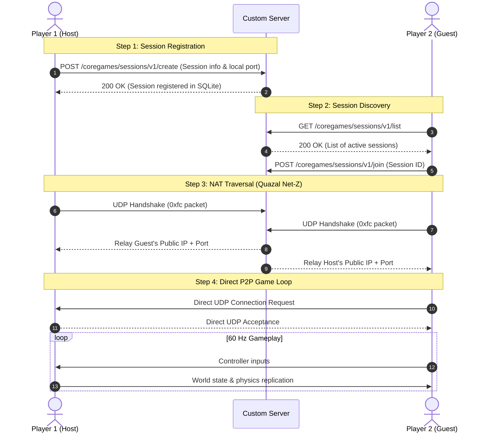

# Technical Blueprint: P2P Multiplayer & Community ToyBox Server

This document provides a comprehensive, accessible technical blueprint for restoring multiplayer and community ToyBox sharing in **Disney Infinity 3.0 (Steam Gold Edition)** using **CrabeLoader**.

---

## 1. Executive Summary

Disney Infinity 3.0 uses a **hybrid network model**:

1. **Lightweight Web Server (HTTP / REST)**: Handles user authentication, service discovery, matchmaking lobbies, and custom ToyBox storage (User Generated Content / UGC).
2. **Peer-to-Peer Simulation (UDP)**: During gameplay, there is **no dedicated game server**. The host's PC simulates physics, AI, and ToyBox logic, while guest players exchange inputs and world state updates directly with the host over UDP at 60 Hz.

```
                  ┌─────────────────────────────────────────┐
                  │          CUSTOM LOCAL SERVER            │
                  │       (Fastify + SQLite Database)       │
                  │  - Authentication & Fake Disney ID      │
                  │  - Lobby / Session Matchmaking Registry │
                  │  - Community ToyBox Storage & REST API  │
                  │  - Quazal NAT Rendez-Vous Service       │
                  └────────────▲───────────────▲────────────┘
                               │               │
                     HTTP / REST               HTTP / REST
                  (Discovery/Lobbies)     (Discovery/Lobbies)
                               │               │
       ┌───────────────────────▼──────┐ ┌──────▼───────────────────────┐
       │     PLAYER 1 (HOST PC)       │ │     PLAYER 2 (GUEST PC)      │
       │  - Injected with CrabeLoader │ │  - Injected with CrabeLoader │
       │  - Simulates game physics/AI │ │  - Sends controller inputs   │
       │  - Hosts ToyBox world state  │ │  - Interpolates scene state  │
       └──────────────▲───────────────┘ └──────────────▲───────────────┘
                      │                                │
                      └─────── Direct UDP Stream ──────┘
                             (Quazal Net-Z P2P)
```

---

## 2. P2P Multiplayer Architecture

### 2.1. Why Peer-to-Peer (P2P)?

* Disney Infinity was never designed to run on dedicated headless server software like *Counter-Strike* or *Minecraft*.
* The **Host Player** acts as the game server for the session.
* The **Central Server** never processes gameplay actions (movement, combat, physics). It acts exclusively as a **matchmaking matchmaker and NAT rendezvous coordinator**.

---

### 2.2. The 4-Step Connection Cycle



#### Step 1: Session Registration (Host)

1. The host player clicks **"Host ToyBox"** in-game or via the CrabeLoader Mod Menu.
2. The game opens a listening UDP socket on a random local port.
3. CrabeLoader intercepts or triggers an HTTP request:
   * **Endpoint**: `POST /coregames/sessions/v1/create`
   * **Payload**: Host username, session title, local IP, local port, current map ID.
   * **Result**: The server saves the active session in SQLite.

#### Step 2: Session Discovery (Guest)

1. The guest opens the multiplayer lobby browser.
2. An HTTP request fetches active sessions:
   * **Endpoint**: `GET /coregames/sessions/v1/list`
3. The guest selects the host's room and clicks **"Join"**.

#### Step 3: NAT Traversal (Quazal Net-Z Hole Punching)

Most players sit behind home routers with firewalls that block incoming connections:

1. Disney Infinity uses Ubisoft's **Quazal Net-Z** network middleware.
2. Both host and guest send a tiny UDP probe packet (`0xfc` opcode) to our server's NAT service.
3. The server inspects the outer IP/UDP header to see the actual public IP and mapped external port assigned by each player's router.
4. The server sends this external address information to both players.
5. Both players send UDP packets directly toward each other's mapped ports at the same time, opening bidirectional passages ("holes") through their respective firewalls.

#### Step 4: Direct UDP Gameplay Loop

1. The game engine establishes direct UDP communication.
2. Player 2 spawns into Player 1's ToyBox.
3. The central server is no longer involved in gameplay: latency is determined solely by the direct distance between the two players.

---

## 3. Community ToyBox Hosting & Downloading

Unlike gameplay (which uses UDP), custom ToyBox sharing (UGC: User Generated Content) is **standard HTTP REST**, identical to downloading or uploading files over the web.

```
                    ┌──────────────────────────────────┐
                    │      FASTIFY STORAGE BACKEND     │
                    │  - REST API                      │
                    │  - SQLite: Metadata & Ratings    │
                    │  - Disk: /storage/toyboxes/      │
                    └────────▲────────────────┬────────┘
                             │                │
            1. POST Upload   │                │  2. GET Download
           (Binary + PNG)    │                │     (.toybox stream)
                             │                │
                    ┌────────┴───────┐┌───────▼────────┐
                    │ CREATOR CLIENT ││ GUEST CLIENT   │
                    └────────────────┘└────────────────┘
```

---

### 3.1. Server Storage Structure

* **SQLite Database (`toyboxes` table)**:
  * `id` (UUID string, primary key)
  * `title` (text, 1-128 chars)
  * `description` (text)
  * `author` (text)
  * `downloads` (integer, default 0)
  * `likes` (integer, default 0)
  * `created_at` (ISO timestamp)
* **Local Disk Directory (`storage/toyboxes/`)**:
  * `<id>.toybox`: Binary map file.
  * `<id>.png`: Thumbnail screenshot.

---

### 3.2. ToyBox Data Flow

#### 1. Browsing Community Maps

* The client sends: `GET /infinity/ugc/v2/steam/?sort=popular&page=1`
* The server responds with a JSON array containing map metadata, download URLs, and thumbnail image links.
* The game UI displays the maps in a browsable grid.

#### 2. 1-Click Download

* The player clicks "Download".
* The client sends: `GET /infinity/ugc/v2/steam/{toyboxId}`
* The server streams the binary `.toybox` file.
* The client writes the file into the local save directory:
  `%USERPROFILE%\Documents\Disney Interactive\Disney Infinity 3.0\`
* The map appears immediately in the "My ToyBoxes" menu.

#### 3. Uploading a ToyBox

* From the pause/save menu, the player clicks "Share".
* The game captures a screenshot (`.png`) and bundles the level file (`.toybox`).
* The client sends: `POST /infinity/ugc/v2/steam/` (multipart form).
* The server stores the files and updates SQLite. The level becomes instantly visible to everyone.

---

### 3.3. The Critical Security Check: Signature Bypass

* **Problem**: Official Disney servers cryptographically signed every ToyBox response with a private RSA key. Unmodified clients check this signature and reject any fan-hosted level.
* **Solution**: A 1-byte memory patch in `DisneyInfinity3.exe` at **RVA `0x00F35790`** (`VerifyResponseSignature`).
* **Effect**: Forcing this function to return `0` (`SIG_RESULT_OK`) allows the game to accept and load any valid `.toybox` file from our fan server without needing Disney's private keys.

---

## 4. Implementation Roadmap

The project is divided into **3 distinct, modular layers**:

```
Layer 1: Standalone Server (Node.js / Fastify / SQLite)
    ↓
Layer 2: Client C++23 Module in CrabeLoader (MinHook)
    ↓
Layer 3: UI & Scripting (Lua Globals + Dear ImGui Tabs)
```

---

### Phase 1: Backend Server Setup

* **Location**: `tools/SparkCapsuleMP/`
* **Stack**: Node.js, Fastify, TypeScript, `better-sqlite3`.
* **Zero Cloud Dependency**: Runs entirely locally or on a private VPS.

#### Core HTTP REST Endpoints Table

| Method   | Endpoint                                  | Purpose                                                               |
| :------- | :---------------------------------------- | :-------------------------------------------------------------------- |
| `GET`  | `/coregames/config/v1/infinity3/steam/` | Service discovery endpoint requested by game at startup.              |
| `POST` | `/coregames/did/v3/`                    | Fake Disney ID authentication; always returns successful login token. |
| `GET`  | `/infinity/ugc/v2/steam/`               | List community ToyBoxes (supports pagination and sorting).            |
| `GET`  | `/infinity/ugc/v2/steam/:id`            | Download binary`.toybox` file.                                      |
| `POST` | `/infinity/ugc/v2/steam/`               | Upload`.toybox` and `.png` thumbnail.                             |
| `POST` | `/coregames/sessions/v1/create`         | Register an active multiplayer host session.                          |
| `GET`  | `/coregames/sessions/v1/list`           | Fetch active multiplayer rooms for matchmaking.                       |

#### Quazal NAT Rendez-Vous Listener

* Listens on UDP port `3074` (or configured port).
* Parses packet opcode `0xfc`.
* Echoes back public IP address and negotiated port to both peers.

---

### Phase 2: Client C++23 Module (CrabeLoader)

To maintain full compliance with the **C++ Enterprise OOP & SOLID Development Standard**:

* Every class has a single responsibility.
* No raw `new` / `delete` (use `std::unique_ptr`).
* Errors return `std::expected<void, std::string>`.
* Headers contain only declarations, types, and interfaces (no inline logic).
* Logic is strictly separated into Domain, Infrastructure, and Application layers.

#### Architectural Structure

```text
include/
├── domain/
│   ├── INetworkRedirector.hpp     // Interface for rerouting game HTTP traffic
│   ├── IEnginePatcher.hpp         // Interface for memory gate patches
│   └── ISessionManager.hpp        // Interface for hosting/joining sessions
├── infrastructure/
│   ├── WinHttpRedirector.hpp      // Implementation hooking WinHttp functions
│   └── MemoryPatcher.hpp          // Implementation applying MinHook byte patches
└── application/
    └── InitializeMultiplayerUseCase.hpp // Orchestrator for setting up mod features
```

#### Memory Patches Specification

All offsets are relative to `DisneyInfinity3.exe` (Steam Gold build, base address typically `0x00400000`):

| Target Function / Check     | RVA              | Patch Type   | Value / Assembly                                     | Purpose                                                       |
| :-------------------------- | :--------------- | :----------- | :--------------------------------------------------- | :------------------------------------------------------------ |
| `IsSignedIn`              | `0x00F62550`   | Ret Override | `mov eax, 1; ret`                                  | Bypasses Disney ID login dialog.                              |
| `IsOnline`                | `0x00F5EE90`   | Ret Override | `mov eax, 1; ret`                                  | Informs engine that an active internet connection is present. |
| `IsOnlineContentAllowed`  | `0x00F630F0`   | Ret Override | `mov eax, 1; ret`                                  | Unlocks online content menus and social tabs.                 |
| `VerifyResponseSignature` | `0x00F35790`   | Ret Override | `xor eax, eax; ret`                                | Returns 0 (success) on all UGC file signature checks.         |
| `HostingSessionGate`      | Signature Search | Byte Patch   | `0x39, 0x56, 0x0C...` $\rightarrow$ `nop; jmp` | Prevents engine from aborting host session creation.          |

#### Network Redirection Specification (`WinHttpRedirector`)

* Uses **MinHook** to detour `WinHttpConnect` and `WinHttpOpenRequest` inside `winhttp.dll`.
* Whenever the server name contains `disney.com`, `disney.go.com`, or `toybox.com`:
  1. Replace the target host with `127.0.0.1`.
  2. Replace the port with `3000` (or the configured custom server port).
  3. Set `SECURITY_FLAG_IGNORE_UNKNOWN_CA` and `SECURITY_FLAG_IGNORE_CERT_DATE_INVALID` flags.
* **Key Benefit**: Players do **not** need to edit `C:\Windows\System32\drivers\etc\hosts` or install local root SSL certificates.

---

### Phase 3: Game Menus & UI (Lua & Dear ImGui)

#### 1. Lua Runtime Overrides

Injected by CrabeLoader at startup without modifying game assets on disk:

```lua
-- Injected into game Lua state
_G.IsMultiplayerAllowed = function() return true end
_G.IsInviteAllowed = function() return true end
_G.IsOnline = function() return true end
_G.IsSignedIntoDisneyID = function() return true end
```

#### 2. CrabeLoader In-Game Overlay (`Crabe.Menu`)

Accessed via the `Insert` key:

* **MULTIPLAYER Tab**:
  * Server Connection Indicator (`Connected to 127.0.0.1:3000` / `Offline`).
  * `[Host ToyBox]` button: Triggers session creation for the currently loaded level.
  * `[Direct Connect]` section: Text field to type a target IP address and `[Join]` button.
  * Active Lobby Browser: List of public rooms retrieved from the local server.
* **TOYBOX STORE Tab**:
  * Search bar & sorting options (Popular, Recent, Highest Rated).
  * Map Cards displaying thumbnail, title, author, and download count.
  * `[Download & Install]` button: Streams the level directly into the save folder in background.

---

## 5. Verification & Testing Protocol

### Test 1: Local Server Health Check

* Command: `curl -I http://127.0.0.1:3000/coregames/config/v1/infinity3/steam/`
* Expected: HTTP status `200 OK` with valid JSON configuration payload.

### Test 2: Network Redirection Verification

* Launch the game with CrabeLoader injected.
* Inspect server console: Ensure inbound HTTP requests appear from the game client without SSL handshake failures.

### Test 3: ToyBox Download Verification

* Place a sample `.toybox` file in `storage/toyboxes/` on the server.
* In-game, browse community content.
* Click download: verify file arrives in `%USERPROFILE%\Documents\Disney Interactive\Disney Infinity 3.0\` and opens properly in-game.

### Test 4: End-to-End P2P Multiplayer Session

1. Machine A (Host) starts a ToyBox and clicks "Host Game".
2. Machine B (Guest) sees Machine A's room in the lobby list and clicks "Join".
3. Verify Quazal NAT handshake output in server terminal.
4. Verify Player 2 avatar spawns into Player 1's world and movements are synchronized at 60 Hz.
