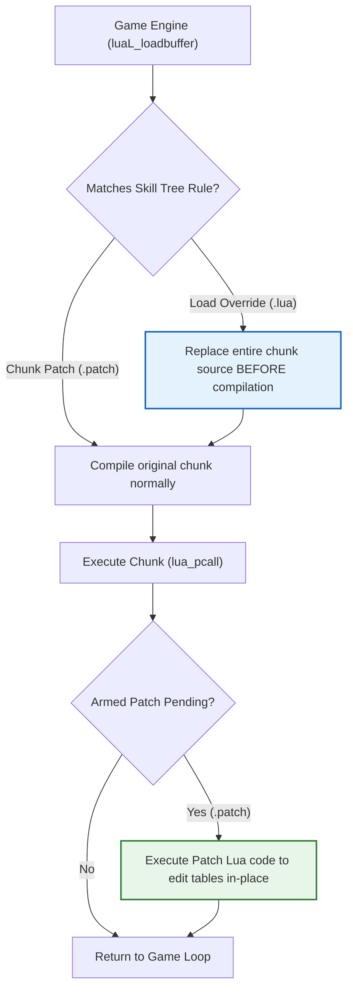

# CrabeLoader V2 — Skill Tree Modding Guide

Welcome to the **CrabeLoader V2** Skill Tree Modding Guide.

In *Disney Infinity 3.0 (PC)*, character abilities, progression paths, and upgrades are stored in encrypted Lua chunks loaded on demand by the game engine. CrabeLoader intercepts these chunks at the bytecode compilation boundary, allowing you to modify or completely overhaul any character's skill tree without altering original game archives.

---

## 1. Architectural Overview

When Disney Infinity 3.0 boots, its engine compiles approximately 1,500 Lua chunks via `luaL_loadbuffer`. CrabeLoader installs a high-speed hook on `luaL_loadbuffer` and offers two distinct ways to modify skill tree chunks:



1. **Load Overrides (`.lua` files):** Completely replaces the chunk source before it is compiled. Use this when redesigning an entire skill tree layout from scratch.
2. **Chunk Patches (`.patch` files):** Runs custom Lua code immediately after the chunk's own function execution completes. Use this to tweak specific nodes, adjust costs, boost stats, or unlock abilities without replacing the whole file.

---

## 2. Directory Placement

Skill tree modifications can be placed in two locations:

### Global Skilltrees Folder
```text
Disney Infinity 3.0 Gold Edition/
└── skilltrees/
    ├── HULK_BASEHEALTH.patch     <- Applied globally to Hulk
    └── tcw_macewindu.lua         <- Wholesale override for Mace Windu
```

### Modular Skilltrees Folder (Inside a Mod)
```text
Disney Infinity 3.0 Gold Edition/
└── mods/
    └── my_character_overhaul/
        ├── mod.json
        └── skilltrees/
            └── ahsoka_custom.patch
```
CrabeLoader automatically scans both `<GameRoot>/skilltrees/` and `<GameRoot>/mods/*/skilltrees/` at startup.

---

## 3. How Chunk Matching Works

You do **not** need to specify memory offsets or exact asset paths. CrabeLoader matches chunks using a **content matching key**:
* The file's stem (the filename without `.lua` or `.patch`) is used as a case-sensitive substring search against the chunk's source code.
* For example, naming your patch `HULK_BASEHEALTH.patch` tells CrabeLoader: *"Find the chunk that contains the string `HULK_BASEHEALTH`, let it build its tables, then immediately run this patch code."*

---

## 4. Writing a Chunk Patch (`.patch`)

A `.patch` file contains plain Lua code that mutates the global or module tables constructed by the target skill tree chunk.

### Example: Boosting Hulk's Base Health
Create `skilltrees/HULK_BASEHEALTH.patch`:

```lua
-- HULK_BASEHEALTH.patch
-- Modifies Hulk's initial durability and health upgrades

if type(SkillTree) == "table" and SkillTree.Nodes then
    for id, node in pairs(SkillTree.Nodes) do
        if node.StatType == "Health" then
            node.BonusMultiplier = (node.BonusMultiplier or 1.0) * 2.5
            node.Cost = 1 -- Reduce upgrade coin cost
        end
    end
end

if type(CharacterStats) == "table" and CharacterStats.Hulk then
    CharacterStats.Hulk.BaseHealth = 1500.0
end
```

Because this runs immediately after the chunk builds `SkillTree.Nodes`, your changes are baked into the character before the UI displays the skill tree.

---

## 5. Writing a Load Override (`.lua`)

A `.lua` file replaces the original chunk entirely before compilation.

### Example: Complete Replacement for Mace Windu
Create `skilltrees/tcw_macewindu.lua`:

```lua
-- tcw_macewindu.lua
-- Custom redesigned skill tree for Mace Windu

SkillTree = {
    TreeName = "MaceWindu_Master",
    Nodes = {
        [1] = {
            Name = "Vaapad Master",
            Description = "Increases lightsaber attack speed and combo damage.",
            Cost = 2,
            Icon = "HUD_Skill_SaberMastery",
            Connections = { 2, 3 },
        },
        [2] = {
            Name = "Shatterpoint",
            Description = "Heavy attacks bypass enemy block shields.",
            Cost = 3,
            Icon = "HUD_Skill_ForceCrush",
            Connections = {},
        },
        [3] = {
            Name = "Force Judgment",
            Description = "Unleashes concentrated electric force bursts.",
            Cost = 3,
            Icon = "HUD_Skill_ForceLightning",
            Connections = {},
        }
    }
}
```

---

## 6. Programmatic Registration from Lua

You can also register overrides and patches dynamically from within a mod script using the `Crabe.Hooks` API:

```lua
local myCustomPatch = [[
    if SkillTree and SkillTree.Nodes then
        SkillTree.Nodes[1].Cost = 0
    end
]]

-- Register a chunk patch programmatically
Crabe.Hooks.patchChunk("AHSOKA_COMBO", myCustomPatch)

-- Register a full source replacement
Crabe.Hooks.overrideChunk("YODA_ACROBATICS", replacementSourceString)
```

---

## 7. Verification & Troubleshooting

1. **Check the Startup Log:**
   Open `loader.log` in the game folder. You should see entries such as:
   ```text
   [INFO] Loader: 1 override(s) and 2 patch(es) registered from skilltrees.
   [INFO] LuaCall: patch 'skilltrees/HULK_BASEHEALTH' applied (342 bytes).
   ```
2. **Compiler Errors:**
   If your patch contains a Lua syntax error, CrabeLoader logs the exact line number and error message without crashing the game:
   ```text
   [ERROR] LuaCall: patch 'skilltrees/tcw_macewindu' failed to compile (status 3): syntax error near 'end'
   ```
3. **In-Game Developer Console:**
   Press **`Insert`** in-game at any time to open the CrabeLoader console and check applied patches in real time.
